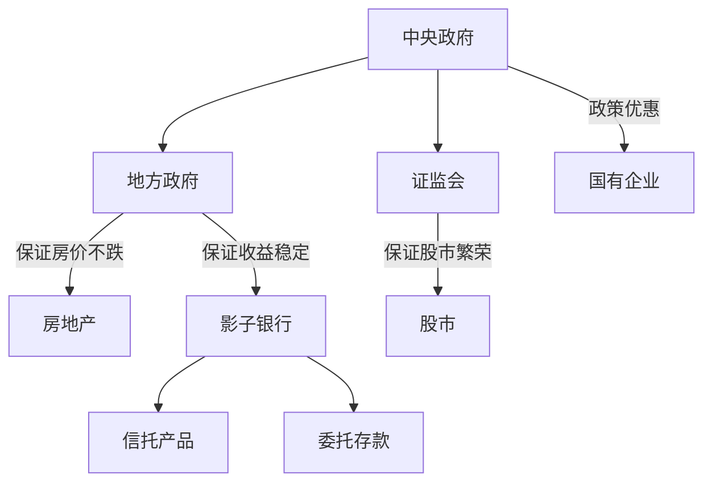

# 刚性泡沫
全书描述了中国经济遇到困境，并认为政府的隐性担保和刚性兑付难辞其咎，同时强调市场自由的重要性。

## 信用流

备注：
- 通过发行收益丰厚同时被认为非常安全的信托产品和理财计划，把资金贷给房地产开发商和地方政府融资平台，这些传统银行不能放贷的领域。
- 委托贷款，一个公司把自己的资金贷给另一个公司，影子银行在其中扮演中介。

为什么说中国存在刚性兑付：
- 国际的证监会职责只有一条，保证市场上的信息披露公正，公平，公开。而中国证监会一直在为股市提供隐形担保，这实际造成了中国股市上的赌博行为更加明显，整个股市长期处于高波动状态。
- 国有企业享有特别的政策优惠，例如垄断行业的准入权，重点核心项目的参与权，政府采购，退税及其他财政优惠。因此导致了中国国有企业的负债过高，产能过剩的明显问题。

### 影子银行
发达国家金融体系:
- 股票
- 债券

中国金融体系
- 银行

为什么影子银行在中国规模如此之大：
- 金融压抑，实体经济对资金的渴求
- 资本金充足率的要求[^1]
    - 影子银行可以帮助银行，将表内业务转至表外，从而削减资产规模，达到降低自有资本金的目的。
- 存贷款比率和存款准备金的要求
    - 通过影子银行把不能算作银行普通存款的银行间存款转成普通存款，从而提高存款规模，降低存贷款比率。

### 房地产
中国房地产存在严重的泡沫，并且通过数据分析，排除了是刚需的动机。
- 房价上涨速度
- 租金和房价比例
- 房价和居民收入比例
- 土地总价值

`传统银行`，`影子银行`和`地方融资平台`很多资金都进入了`房地产`。这些金融机构都因房地产面临巨大的风险敞口。

### 中国股市
中国股市缺乏抑制泡沫增长的工具
- 做空机制
- 衍生品种类太过单一
- 外汇限制，导致了哄抬国内资产价格

A股严厉的审批制度带来一下的缺点：
- 很多真正的好公司并不能在A股上市
- 严厉的审批，会误导投资者，认为能在A股上市的公司都是好公司，降低了投资者的判断能力
- 严厉的审批，造成了A股公司普遍的高估值
- 严厉的审批，将投资风险部分转移到证监会，这一中性机构，相当于提供了隐形担保。
- 没有完备的退市机制，导致上市公司融资之后，并不扩大主营业务，而是投入到房地产等领域，扩大了整个系统风险。

### 中国的金融创新
中国特色的金融产品:
- 余额宝之类的互联网金融产品
    - 网民数量之大，人均理财数额不大，提供了充足的流动性
    - 中国网民缺乏理财常识，并不能意识到其中的风险
    - 互联网企业通过做大自己，吸引政府关注，将该类投资品的风险转加给政府，让政府为其提供隐形担保和刚性兑付。
- P2P
- 大宗商品融资
    - 套利机制，依赖于大宗商品的价格稳定

### 中国经济动力
三驾马车
- 出口
    - 劳动力优势减弱
    - 企业生产效率低下
- 内需
    - 中国社会文化导致人们对奢饰品的追求，并不能促进国内的消费需求
    - 日益高涨的房价，挤压年轻人的消费需求
    - 高度不确定的社会保障体制，提高了人们的存款需求
- 投资
    - 中国企业的投资回报率在下降

### 产能过剩
中国经济面临产能过剩的主要行业
- 钢铁，水泥，电解铝，平板玻璃，造船
- 汽车行业
- 新能源行业：光伏，风电

产能过剩的三个原因
- 中央政府和地方政府责任不可推卸
    - 中央政府在规划中，点名了某些行业，就会导致地方政府过分实践，从而资金资源大量涌入，立马导致行业的产能过剩
- 企业本身不可推卸
    - 企业乐观认为中国经济的高速增长会一直持续，因此疯狂扩张
    - 疯狂的扩张，期望获得政府的隐形担保
- 金融制度的不完善
    - 破产制度，缺乏合理的退出制度
    - 只要国内的利率水平和人民币汇率还受到管制，那么市场将无法最大限度地发挥其配置资源的功能

### 国有企业概貌
中国国有企业规模宏大的原因(现在似乎互联网公司已经超过这些国有企业了)
- 宏观经济因素，中国经济大盘发展很好
- 国家政策的导向

国有企业的优势
- 业务规模大
- 品牌相对民企较硬
- 行业具有垄断特性

国有企业的劣势
- 实现的目标多元化，不能利润最大化，提升运行效率
- 政府和国有企业关联太大，仕途上升比企业利润最大化更要
- 中央计划者很难收集国有企业真实的运营信息
- 因为一股独大，公司治理缺失
- 负债过高，杠杆过高

对比上面，国有的劣势，可以想像到国有企业改革方向有
- 削减债务，去杠杆
- 利率化市场改革，增加国企的融资难度，促进投资的效率，也可以去杠杆
- 放松行业管制和政策限制，让民企更多参与到与国企的竞争中
- 完善国企信息披露制度和考评制度
- 法制改革，划清政府和市场的界限

### 巫术统计学
中国官方的统计数据灵活性很大。
`研究一项数据指标，必须要明白指标的具体计算方式`

### 总结
中国经济取得成功的原因
- 改革开放等制度的保证
- 政府对流动性的注入的保证
- 政府对投资收益的保证

中国经济走出困境的方式
- 市场在资源配置中起决定性作用
- 调整政府和市场的关系
- 加强法制建设，实现“买者自负，卖者有责”
- 媒体监督政府和市场的关系
- 政府退出
    - 降低货币供应量
    - 利率市场化
    - 资本项下放
    - 退出房价保障
    - 退出股票市场保障
    - 加强影子银行，P2P监管
    - 中央政府退出对地方政府的债务担保

## 摘要
- 如果企业的经营者预计货币供应会越拉越宽松，那么一定可以预测到，资产价格出现明显的上涨。在对国家的通胀水平和资产价格有如此的预期之下，企业经营者合乎逻辑的做法就是大规模借入债务和扩张自己的资产和产能，以期待在下一轮的泡沫中获利。很多开始被认为是非常激进的投资举措，随着泡沫的快速扩张，事后被认为是非常明知的，甚至是非常神圣的。这种成功押宝的经济扩张和资产价格升值的经验，导致企业家越来越有信心进行尽可能的固定资产投资和产能扩张。
- 破产是对资源的重新配置
- 破产本身最有价值的一点，就是让市场决定哪些企业可以存活哪些不可以，哪些资产还有价值哪些没有
- 死亡是生命最伟大的发明（乔布斯）

# 脚注
[^1]: 巴塞尔协议要求银行的自有基本金必须达到总资产规模的百分之八。