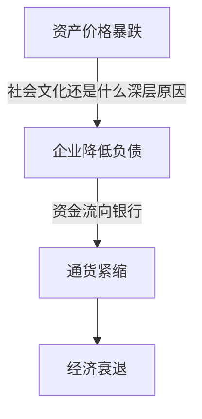
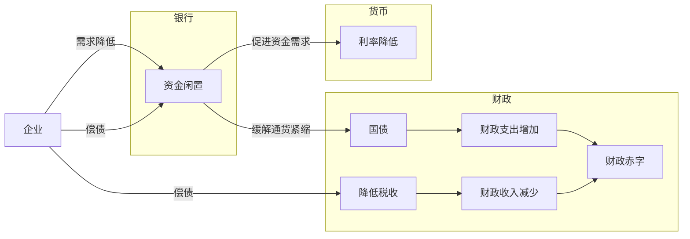
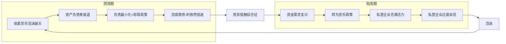
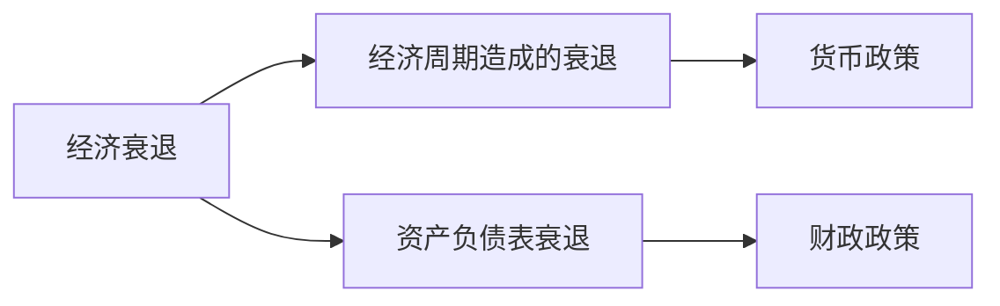

# 大衰退
这本书主要从资产负债表衰退的角度来分析日本消失的20年。
同时作者也利用资产负债表衰退的概念来重新诠释**流动性陷阱**[^2]

## 个人感悟
### 什么是资产负债表衰退
资产负债表衰退，通常是指，由于各类资产价格**暴跌**，导致私营企业从扩大经营规模，扩大利润来源等等原始的的目的，转化以降低企业负债为目的，从而导致企业的资金需求不足，进而导致通货紧缩形式的经济衰退。

这整个流程还是有一些值得商榷的地方。
- 资产价格暴跌 --> 资产负债表的难看 --> 企业开始偿债。作者认为这个过程中，货币政策已经失效，但是作为一个企业经营者，面对低成本（低利率）的资金，如果企业本身盈利模式没有出现问题，那完全可以通过：
借贷 --> 扩大生产 --> 更多的利润 --> 购置更多的资产， 这套流程来解决资产负债表的问题。
**到底是什么因素导致了大部分的日本企业选择了，以降低负债来解决资产负债表的问题**

### 资产负债表衰退是日本经济衰退的佐证
- 不是结构性的问题：因为日本没有结构性问题带来的种种弊端：例如，工人罢工，巨额贸易逆差，货币贬值。[^1]
- 数据佐证了，企业对资金的需求确实在降低，而且并非由于银行采取了信贷紧缩政策。

### 资产负债表衰退背景下，各个组件的关系

- 如果资产负债大幅度衰退，货币政策失效，只剩下财政这个手段来调控，政府此刻应该杜绝财政整顿。
- 汇率政策，降低汇率，对于贸易逆差的国家可以在缓解资产负债衰退。
    - 在一个经济正常的世界里，市场可以如此调节汇率的平衡。`降低汇率`-->`出口增加` --> `刺激国内经济`-->`进口增加`-->`贸易平衡` 。
    - 在资产负债表衰退的世界里，汇率降低的影响如下，`降低汇率`-->`出口增加`-->`刺激国内经济`-->`企业赚来的利润去还债`
    - 因此在资产负债表衰退的世界里，贸易顺差的国家，降低会使得贸易顺差进一步扩大，这会导致其他国家，采取对应的汇率政策，以阻止该国的汇率的降低。但是对于贸易逆差的国家，只会降低贸易逆差，不会导致外界对其有很明显的反向操作。
### 阴阳周期理论

在阴阳周期理论中需要注意的：
- 阴周期，并不一定意味总的经济下行，但是私营企业的经济活动肯定比较萎靡。
- `大周期`和`小周期`的轮转。
- 阴阳周期最主要的区别在于`私营企业的的财务状况`

**所谓的宏观经济学新的圣经**
阳周期：
- 新古典主义
- 货币主义
- 凯恩斯主义
- 新凯恩斯主义

阴周期：
- 资产负债表衰退理论

||阳的世界|阴的世界|
|---|---| --- |
|现象|教科书的经济学|资产负债表衰退|
|法则|亚当斯密的“看不见的手”|合成谬误[^5]|
|企业财务|资产>负债|资产<负债|
|行动原理|利润最大化|负债最小化|
|结果|最大多数的幸福|置之不理则将导致萧条|
|货币政策|有效|无效(流动性陷阱)|
|财政政策|负效应(挤出效应)|有效|
|物价|通货膨胀|通货紧缩|
|利率|正常|极低|
|储蓄|美德|恶徳|
|银行危机对策|优惠和迅速处理不良贷款|资本注入和谨慎处理不良贷款|
### 几个有意思的观点
- 定量宽松政策的解除不等于金融紧缩政策
    - 央行向商业银行出售国债，清除流动性，在一般的情况下，因为商业银行，没有用来购买国债的闲置资金，所以抛售金融资产，导致金融资产价格降低，经济热度下降，金融趋于紧缩。但是在资产负债表期间，商业银行有足够的闲置资金来，购买国债，不够成金融紧缩。
- 财政赤字和GDP的比率没有增长并不能说明财政政策的失效。因为有两种情况，第一种，就是财政支出和税收确实没有大幅度变化，这种情况下，财政政策影响甚微；第二种，财政支出增加，刺激了经济增长，因而税收也同步增加，所以赤字比率没有改变。在这种情况下，扩张的的财政政策明显起到了很大的作用。
- 

- 泡沫之所以成为泡沫，就是因为资产价格水平再也无法通过现金流量折现法来判断。

## 摘要
- 福井俊彦：只有等到私营部门的资金需求变得更加强劲之后，政府的财政改革与之配套，这样才不会出现问题。
- 传统经济学的大前提假设：假设那些导致经济脱离正常轨道的外部冲击的性质并不十分重要，因此，即使收到外部冲击，受其影响的经济行为者的既定目标也不会改变。资产负债表衰退这一概念主张，特定的外部冲击会从根本上改变企业和个人的行为目标。
- 中央银行绝对不可以承担过多的风险，这是因为今天的货币完全是由中央银行的信用来担保，而非黄金和白银[^3]。
- 只要一个国家的中央银行能够正常运作，那么无论再大的政府预算赤字，其导致的高利率和私人投资挤出效应的负面影响都是有限的，但是一旦中央银行迫于政府压力，执行有损公共信赖的政策，则必将承受灾难性的后果。
- 凯恩斯主义的重大缺陷：
    - 完全没有考虑资产负债表的问题
    - 将利率过低导致金融政策失灵绝对地归咎于，流动性偏好使得公众将资金从债券转为现金，而不考虑流动性偏好中，借贷方的需求转换
    - 没有解释对经济和资产价格影响显著的货币政策为什么失灵
## 数据
- 查看全体银行的资产负债表，可以得到各组件的借贷信息，以及全国范围的货币供应量，货币乘数等等指标。
- 存款周转率在某种程度上可以衡量资产价格的泡沫大小。逻辑来自于，金融资产过热的时候，会引发民众的大量交易。

## 建模
- 债务和资金需求的矛盾
    - 寻找一个模型来描述，资产下跌的程度与还债的关系，以此寻求量化资产负债表衰退的程度。

## 脚注
[^2]: 利率低至债券收益等同于货币，资金供应大量囤积货币的行为。
[^1]:贸易逆差-->货币贬值；贸易顺差-->货币升值的原理：当一个国家有巨大贸易逆差的时候，即进口量>出口量。进口企业需要将本国货币兑成外币用来购买，出口企业会将赚来的外币换成本国货币，进口量大的时候，对外币的需求就会大，根据供给需要关系，对应的外币升值，本国货币贬值。
[^3]:如果中国央行过分超发货币，人们对央行的信任是不是并不会像西方那样迅速降低。在这种情况下，央行的超发货币，并不会在短时间内提升人们对于通货膨胀率上升的预期。
[^5]: 每个个体都做局部正确的事情，但是全局的效益却因此降低。