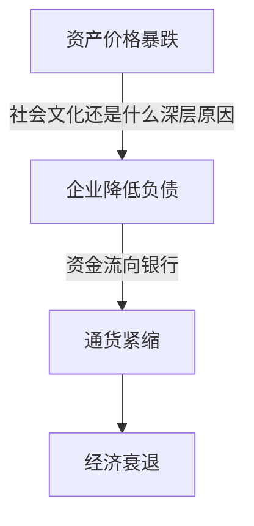

# 大衰退
这本书主要从资产负债表衰退的角度来分析日本消失的20年。

## 个人感悟
### 什么是资产负债表衰退
资产负债表衰退，通常是指，由于各类资产价格暴跌，导致私营企业从扩大经营规模，扩大利润来源等等原始的的目的，转化以降低企业负债为目的，从而导致企业的资金需求不足，进而导致通货紧缩形式的经济衰退。

这整个流程还是有一些值得商榷的地方。
- 资产价格暴跌 --> 资产负债表的难看 --> 企业开始偿债。作者认为这个过程中，货币政策已经失效，但是作为一个企业经营者，面对低成本（低利率）的资金，如果企业本身盈利模式没有出现问题，那完全可以通过：
借贷 --> 扩大生产 --> 更多的利润 --> 购置更多的资产， 这套流程来解决资产负债表的问题。
```到底是什么因素导致了大部分的日本企业选择了，以降低负债来解决资产负债表的问题```

### 资产负债表衰退是日本经济衰退的佐证
- 不是结构性的问题：因为日本没有结构性问题带来的种种弊端：例如，工人罢工，巨额贸易逆差，货币贬值。[^1]
- 数据佐证了，企业对资金的需求确实在降低，而且并非由于银行采取了信贷紧缩政策。

### 资产负债表衰退背景下，各个组件的关系
疯癫


## 摘要


## 脚注
[^1]:贸易逆差-->货币贬值；贸易顺差-->货币升值的原理：当一个国家有巨大贸易逆差的时候，即进口量>出口量。进口企业需要将本国货币兑成外币用来购买，出口企业会将赚来的外币换成本国货币，进口量大的时候，对外币的需求就会大，根据供给需要关系，对应的外币升值，本国货币贬值。